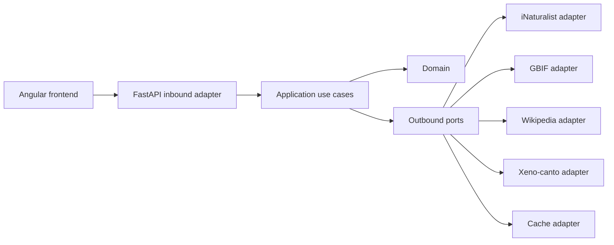

# Birds Atlas

Birds Atlas is een responsive Angular-vogelatlas met een Python 3/FastAPI-backend. De voormalige .NET 8-implementatie blijft tijdens deze migratie in `backend/BirdsAtlas.Api/` staan als functionele referentie en terugvaloptie. De actieve lokale en Vercel-configuratie wijst naar `backend-python/`.

## Waarom Python en FastAPI

De port maakt de externe databronnen expliciet vervangbaar en testbaar. FastAPI is uitsluitend de inbound HTTP-adapter. De use cases kennen geen FastAPI, Vercel, httpx of environment variables. Externe API's en caching zijn outbound adapters achter ports.



De dependency rule is naar binnen gericht: adapters mogen application en domain importeren; application mag domain en port-protocols importeren; domain importeert geen infrastructuur.

## Structuur

- `frontend/`: bestaande Angular 18-app.
- `backend-python/src/birds_atlas/domain/`: dataclasses, enums, invarianten en domeinexceptions.
- `backend-python/src/birds_atlas/application/`: use cases en outbound ports.
- `backend-python/src/birds_atlas/adapters/inbound/fastapi/`: routes, Pydantic-contracten, dependency injection en foutvertaling.
- `backend-python/src/birds_atlas/adapters/outbound/`: httpx-adapters en async-veilige TTL-cache.
- `backend-python/src/birds_atlas/bootstrap.py`: composition root.
- `api/index.py`: door Vercel herkend FastAPI-entrypoint.
- `backend/BirdsAtlas.Api/`: behouden .NET-bron van waarheid tijdens de migratie.

## API-contract

De bestaande routes en camelCase JSON-contracten blijven behouden:

- `GET /api/health`
- `GET /api/birds`
- `GET /api/birds/{id}`
- `GET /api/birds/{id}/occurrences`
- `GET /api/taxonomy/options`

De Angular-modellen zijn niet gewijzigd. Paginering blijft `page=1`, `pageSize=24`, maximaal 10.000 pagina's en maximaal 48 items. Occurrences blijven standaard 300 en maximaal 500. Continentpagina's met een offset boven 240 worden geweigerd om onbeperkte fan-out naar externe API's te voorkomen. Een continentzoekactie scant bovendien een begrensde bronset en retourneert zo nodig een geschat totaal.

## Hexagonale lagen

### Domain

Zuivere Python-dataclasses, enums, validatieregels en domeinexceptions. Deze laag importeert geen FastAPI, Pydantic, httpx, cachingbibliotheek of configuratie.

### Application

De use cases `SearchBirds`, `GetBirdDetail`, `GetBirdOccurrences`, `GetTaxonomyOptions` en `CheckHealth` orkestreren de domeinobjecten. Ze zijn afhankelijk van protocols voor catalogus, taxonomie, occurrences, encyclopedie, opnames, cache en klok.

### Outbound adapters

- `INaturalistHttpAdapter`: taxa, lokale namen, foto's, status en taxonomiefilters.
- `GbifHttpAdapter`: species-match, taxonomie, continentfacets en kaartpunten.
- `WikipediaHttpAdapter`: veilige samenvattingen via een Wikipedia-hostallowlist.
- `XenoCantoHttpAdapter`: maximaal drie opnames wanneer een key aanwezig is.
- `InMemoryTtlCacheAdapter`: async-veilige, niet-duurzame serverless cache.

### Inbound adapter

FastAPI vertaalt query- en pathparameters naar domeininput, serialiseert Pydantic-responsemodellen, zet application exceptions om naar HTTP-responses en voegt cacheheaders en OpenAPI-documentatie toe. Routers bevatten geen externe API-logica.

## Lokaal starten

Python 3.12 wordt aanbevolen.

```bash
python -m venv .venv
source .venv/bin/activate
pip install -r backend-python/requirements-dev.txt
uvicorn birds_atlas.adapters.inbound.fastapi.app:app \
  --app-dir backend-python/src \
  --host 127.0.0.1 \
  --port 5078 \
  --reload
```

Start daarna Angular in een tweede terminal:

```bash
npm ci --prefix frontend
npm start --prefix frontend
```

`frontend/proxy.conf.json` proxyt `/api` naar `http://localhost:5078`.

Voor een lokale benadering van Vercel-routing kan ook `vercel dev` vanaf de repository-root worden gebruikt.

## Configuratie

Kopieer `backend-python/.env.example` naar een lokaal, niet-gecommit `.env`-bestand of exporteer variabelen via de shell/Vercel:

- `INATURALIST_BASE_URL`
- `GBIF_BASE_URL`
- `WIKIPEDIA_BASE_URL`
- `XENO_CANTO_BASE_URL`
- `XENO_CANTO_API_KEY`
- `HTTP_CONNECT_TIMEOUT_SECONDS`
- `HTTP_READ_TIMEOUT_SECONDS`
- `CACHE_DEFAULT_TTL_SECONDS`
- `LOG_LEVEL`

Veilige publieke URL's en time-outs zijn standaard ingesteld. Zonder Xeno-canto-key levert `recordings` correct een lege array op. Secrets horen uitsluitend in lokale environment variables en Vercel Environment Variables.

## Tests en kwaliteit

```bash
python -m compileall backend-python
pytest backend-python
ruff check backend-python
mypy backend-python/src
npm ci --prefix frontend
npm run build --prefix frontend
```

Tests gebruiken fake ports of gemockte HTTP-responses en benaderen geen live databronnen. De contracttests controleren de camelCase veldnamen, nullability, arrays, geneste objecten en datumserialisatie tegen `frontend/src/app/models.ts` en `api.service.ts`.

## Externe communicatie en foutafhandeling

De composition root maakt herbruikbare `httpx.AsyncClient`-instanties met expliciete connect-, read-, write-, pool- en totale time-outs, connection limits en een herkenbare User-Agent. Verrijking en continentchecks gebruiken begrensde semaphores. Rate limits worden als 503 met `Retry-After` vertaald, time-outs als 504 en overige verplichte upstreamfouten als 502. Optionele GBIF-verrijking, Wikipedia en Xeno-canto degraderen naar lege metadata, zoals in de .NET-backend. De occurrence-route behoudt upstreamfouten zodat de kaart een storing van een werkelijk leeg resultaat kan onderscheiden.

## Caching en serverless

`InMemoryTtlCacheAdapter` implementeert `CachePort` met een `asyncio.Lock`. De cache versnelt taxa, GBIF-matches, continentchecks, naamordening en taxonomieopties, maar is niet duurzaam: cold starts beginnen leeg en verschillende Vercel Function-instances delen geen geheugen. Correctheid hangt nooit af van een cachehit. Er worden geen gebruikersgegevens publiek gecachet.

## Vercel

De configuratie volgt de actuele Vercel-conventies voor FastAPI en Python Functions:

- Root Directory: repository-root (`.`), zodat `frontend/`, `api/` en `backend-python/` samen beschikbaar zijn.
- Framework Preset: Other.
- Install Command: `npm ci --prefix frontend && pip install -r requirements.txt`.
- Build Command: `npm run build --prefix frontend`.
- Output Directory: `frontend/dist/birds-atlas-web/browser`.
- Python-versie: `3.12` via de root `.python-version`.
- Function entrypoint: `api/index.py`, met een geëxporteerde FastAPI-instance `app`.
- API-routing: Vercel stuurt `/api/...` automatisch naar de FastAPI-entrypoint; FastAPI definieert daarom de volledige `/api/...`-routes.
- SPA-fallback: alleen niet-API-paden worden naar `/index.html` herschreven, zodat browserrefreshes op Angular-routes werken zonder API-loop.
- Environment Variables: configureer de variabelen hierboven afzonderlijk voor Preview en Production.
- Production Branch: `main`.

Koppel de GitHub-repository één keer aan een Vercel-project. Git-integratie maakt Preview Deployments voor pull requests en niet-productiebranches en Production Deployments voor wijzigingen op `main`. Controleer in een preview minimaal `/api/health`, `/api/birds`, de Angular-root, statische assets en een browserrefresh op een Angular-route.

Vercel Services is niet nodig voor deze variant: Angular wordt als statische output gebouwd en FastAPI draait als één Python Function binnen hetzelfde project. Bij toekomstige opsplitsing in onafhankelijk gebouwde frontend- en backendservices kan Vercel Services of twee gerelateerde monorepo-projecten worden overwogen.

## Databronnen

- iNaturalist: soorten, namen, foto's, IUCN-status en taxonomiefilters.
- GBIF: soortmatch, taxonomie, continenten en kaartpunten.
- Wikipedia/MediaWiki: samenvattingen via een HTTPS Wikipedia-hostallowlist.
- Xeno-canto: maximaal drie opnames wanneer een API-key is geconfigureerd.

## Migratiestatus

Fase 1 tot en met 4 zijn uitgevoerd: analyse, Python naast .NET, contracttests en omschakeling van lokale/Vercel-routing. De .NET-map is bewust nog niet verwijderd. Verwijdering hoort pas in een aparte wijziging nadat de CI-build, een Vercel Preview Deployment en een live Angular-naar-FastAPI-smoketest met alle externe providers succesvol zijn bevestigd. De actuele checklist staat in `backend-python/PARITY.md`.
